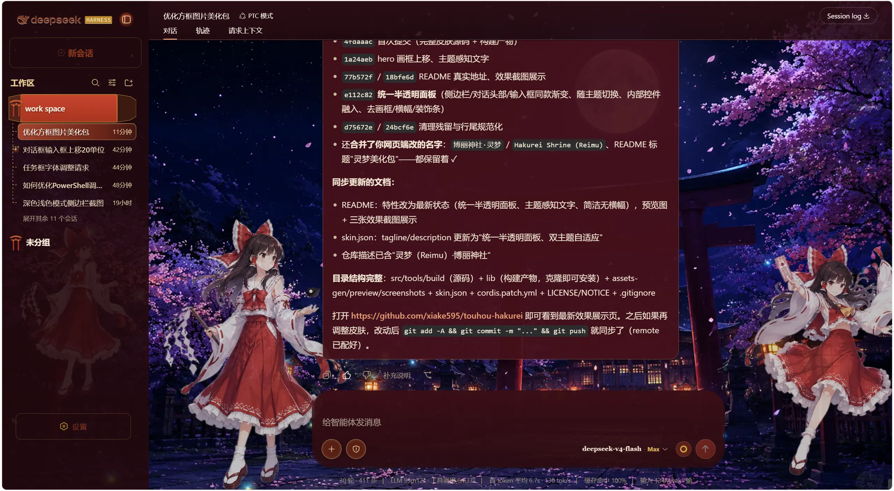
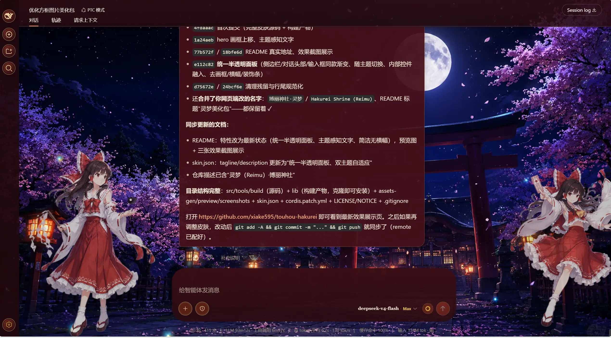
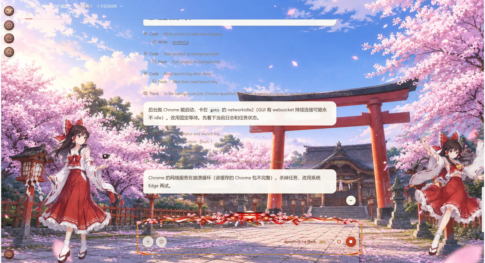

# touhou-hakurei · 灵梦美化包：博丽神社（东方Project 主题皮肤）

DeepSeek Harness Web GUI 的东方Project 博丽神社主题皮肤：博丽神社昼夜实景背景、
灵梦左右立绘、朱红/纸白/金色的神社装饰界面。纯展示层客户端插件 —— `apply()`
设置 `data-dsh-hakurei` 作用域、按亮/暗主题切换神社背景、以独立透明层挂载灵梦
角色、装饰可折叠侧栏，并为加载/思考/工具运行状态预留稳定动画钩子。effect 销毁器
还原全部 CSS/DOM 写入；不注入服务、不发出 Cordis 事件、不触达模型请求。

## 预览

| 亮色主题 | 暗色主题 |
| --- | --- |
|  |  |

## 效果展示

| 深色主题 · 场景一 | 深色主题 · 场景二 | 浅色主题 |
| --- | --- | --- |
| [](screenshots/shot-dark-1.webp) | [](screenshots/shot-dark-2.webp) | [](screenshots/shot-light.webp) |

## 特性

- 博丽神社昼/夜实景对话背景（亮/暗主题自动切换，窗口顶部无遮挡条）
- 灵梦站姿/飞行双立绘（左侧栏联动避让、对话页移向安全边缘）
- **侧边栏竖幅画框**（方框.png）：纸白帘头、朱红立柱、装饰脚带；画框透明中心
  直接透出神社背景，棕色衬板与按钮板纸白化，折叠成窄栏时自动恢复深色底
- **输入框九宫格画框**（对话框.png）：纸白帘头、朱红立柱、装饰脚带贴住输入框
  顶部，输入区透明底拉满、文字带浅色描边保证可读
- 朱红、纸白、金色 UI 覆盖层（着陆页横幅、鸟居装饰、朱印牌按钮、日轮/缘带）
- Q 版灵梦侧栏角色、灵梦头像 favicon、博丽神社标题字标
- 素材内嵌于 client bundle（数据 URI），激活不依赖任何临时文件/远程 URL

## 安装

方式一：本地路径（开发 / 已克隆仓库）

```sh
dsh plugin --profile web add <本目录绝对路径>
```

方式二：GitHub 分发（克隆后安装）

```sh
git clone https://github.com/xiake595/touhou-hakurei
dsh plugin --profile web add <克隆路径>
```

也可以直接对 DSH 说："安装一下这个皮肤包：<仓库 URL>"。

加载即生效、卸载即复原（`wiring.id` 为 `ui-skin-hakurei`）。皮肤之间的
互斥切换由皮肤管理工具（如 dsh-skin）或 profile 的 bundles 配置管理。

## 素材

仓库内的素材嵌入（`assets-gen/` 与 `src/client/*.generated.ts`）已经生成完毕，
克隆后无需本地素材即可直接构建使用。

如需替换为自己准备的素材：

1. 准备素材目录（默认 `C:\Users\1\Desktop\图片`），包含：
   - `processed-v2/`：`bg-light.webp` `bg-dark.webp`（神社昼夜背景）、
     `reimu-stand.webp` `reimu-fly.webp`（灵梦立绘）、`banner.webp`（横幅）
   - `方框.png`（侧边栏竖幅画框）、`对话框.png`（输入框横版画框）
2. 修改 `tools/generate-assets.cjs` 顶部的 `ASSETS_DIR` / `RAW_DIR` 路径
3. 运行 `node tools/generate-assets.cjs` 重新生成素材嵌入

装饰素材（鸟居、日轮、朱印牌、缘带、工作区缎带等）由
`tools/generate-assets.cjs` 程序化生成（SVG → webp）。

## 开发与构建

```sh
pnpm install
pnpm build        # tsdown 构建 lib/（node 入口 + client bundle）
```

辅助脚本：

```sh
node tools/generate-assets.cjs   # 重新生成素材嵌入（需要 sharp 与本地素材）
node tools/rewrite-css.cjs       # 重新生成 hakurei.module.css（色板转换）
node tools/rewrite-index.cjs     # 重新生成 src/client/index.ts（重命名/横幅接线）
```

## 致谢与许可

- 皮肤工程结构（构建预设 `build/tsdown.client.ts`、皮肤脚手架、布局/动画工程）
  源自 [dsh-deep-whale](https://github.com/Small-tailqwq/dsh-deep-whale) 的
  maid-atelier（作者 Small-tailqwq）
- 背景 / 角色 / 画框素材来自用户本地素材（详见 `NOTICE`）
- 本皮肤以 **CC BY-NC-SA 4.0** 发布，禁止任何商业性使用。见 `LICENSE` 与
  `NOTICE`。